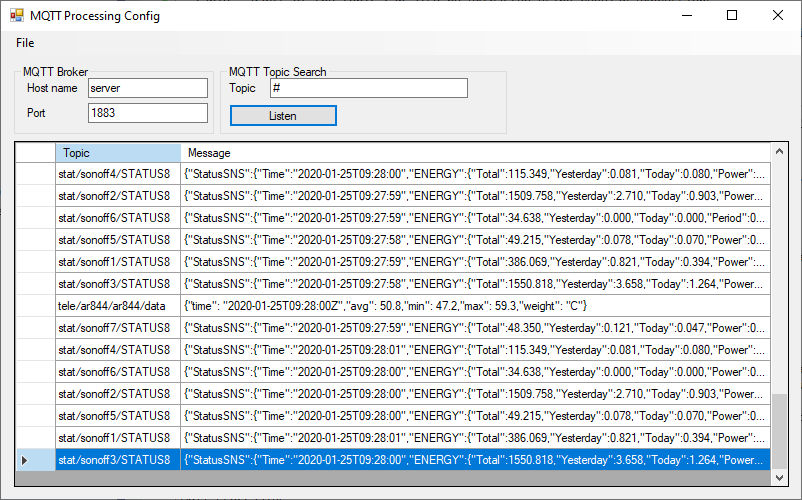
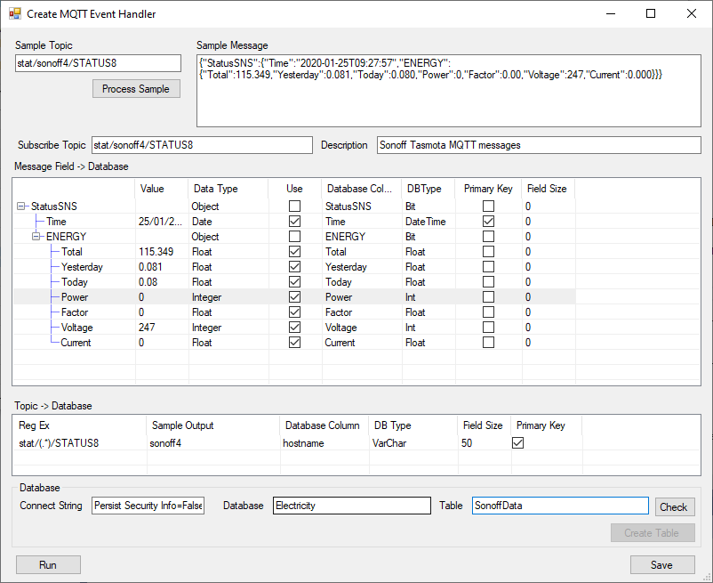

# MQTT_Processing

MQTT Event handler.

This is an interactive program that allows you to capture MQTT messages and attach an event to them.  Currently this is limited to storing the data in a Microsoft SQL Server database.  Individual fields of the JSON message are stored in columns of the table.  Parts of the topic can also be extracted using regular expressions.

After a configuration has been created for a message, this can be used by a windows service to run permanently.

## Configuration

The MQTT_Processing_Config application is used to create event configurations.



Field | Description
--- | ---
Host name | The MQTT Broker hostname (or IP address).
Port | The MQTT Broker Port.  Usually 1883.
Topic | The search topic.  Standard MQTT topic wildcards, '#' and '+' can be used.

The Listen button will start listening for messages matching the topic.

When the message you want to capture appears, stop listening, right click on the row, and select "Create MQTT Event Handler".

There are also main menu options to "Open" an event configuration saved from the "Create MQTT Event Handler Screen", or create a "New" event handler, not based on a captured message.




The Create MQTT Event Handler form is used to define and test the event handler.

Field | Description
--- | ---
Sample Topic | Topic populated from captured MQTT message or you can type your own.  This is used to test the regular expressions in the topic field extractor.
Sample Message | Message populated from captured MQTT or you can type your own.  This is used to populate the json field mapper.
Process Sample | Button activates JSON parser.  Parses the MQTT message and extracts JSON fields.  This will erase any existing configuration.
Subscribe Topic | This is the topic that will be subscribed through the MQTT broker.  Wildcards can be used.
Description | Friendly name of the event handler
Message Field -> Database | Shows the JSON field to database column mappings.  Set details below.
Topic -> Database | Shows the data extracted from the MQTT topic to database mapping.  Details below.
Connect String | The Database Connect string.  Used to identify the database server and security.
Database | The name of the database.
Table | The name of the table.
Check | The database validation button.  Verifies the connect string, and the database exists.  For a new table, confirms the table doesn't exist.  For an existing table, compares the existing table with mapping definitions.  Differences between column names, types, and primary key definitions are reported.
Create Database | Creates the database.  Only creating new databases is currently supported.  
Run | Runs the event handler.  This does what the real service would do.  It subscribes to the topic, processes the messages and writes the records to the database.  This is run in a separate window with a log display, showing the message and database query to insert the row.
Save| Saves the configuration into a *.mqtp file (which is xml).

Message Field -> Database

This table contains a mapping of the message field to the database column.  It is populated by parsing an existing JSON message.  Rows cannot be added or removed manually.

Field | Description
--- | ---
Value | Sample value, only used for reference.
Data Type | The data type the JSON parse deduced from the sample data.
Use | The row must be selected for the field/column pair to be used.
Database Column | The name of the database column.
DBType | The database column data type.
Primary Key | Does this column make up the primary key.  When a primary key is defined, the insert statement will not overwrite a duplicate record.
Field Size | The length of the field.  This must be set for string/VarChar types.

Topic -> Database

This table defines the extraction of parts of the topic to the database column.  Create and delete rows using the context menu (right click) of the table.

Field | Description
--- | ---
Reg Ex|The regular expression used to extract part of the topic message.  This uses the .Net RegularExpression classes.  For example, my Sonoff Tasmotta MQTT messages are of the format `stat/hostname/STATUS8`.  To extract the hostname, I use a regular expression with capture; `stat/(.*)/STATUS8`.  Captures must be used.  Only the first capture is returned.
Sample Output | This shows what the regular expression will generate when the Sample Topic is processed.
Database Column | The name of the database column.
DBType | The database column data type.
Primary Key | Does this column make up the primary key.
Field Size | The length of the field.  This must be set for string/VarChar types.

## Service

The MQTT_Processing service will take the MQTT Event Handler files and process then in a background process.  Multiple events are supported.  They all need to run off the same broker (probably an unnecessary limitation).

MQTT_Processing.exe.config contains the configuration...


```xml 
<?xml version="1.0" encoding="utf-8" ?>
<configuration>
  <configSections>
    <section name="mqttConfig" type="MqttConfig.MqttConfig, MqttConfig, Version=1.0.0.0, Culture=neutral, PublicKeyToken=null"/>
  </configSections>
  <startup>
    <supportedRuntime version="v4.0" sku=".NETFramework,Version=v4.7.2" />
  </startup>
  <system.diagnostics>
    <trace autoflush="true" indentsize="4">
      <listeners>
        <add name="myListener" type="System.Diagnostics.TextWriterTraceListener" initializeData="TextWriterOutput.log" traceOutputOptions="DateTime" />
        <remove name="Default" />
      </listeners>
    </trace>
  </system.diagnostics>

  <mqttConfig brokerServer="Server" brokerPort="1883" xmlns="MqttConfig">
    <mqttEventHandlers>
      <mqttEventHandler Name="AR844 Sound Meter" File="d:\bin\MQTT_Processing\ar844.mqtp"/>
      <mqttEventHandler Name="Ant Weight Scale" File="d:\bin\MQTT_Processing\weight.mqtp"/>
    </mqttEventHandlers>
  </mqttConfig>

</configuration>
```

Here we define the `brokerServer`, `brokerPort` and a list of `mqttEventHandler` entries.

The service is installed using the .net install utility...


```bash
> c:\Windows\Microsoft.NET\Framework\v4.0.30319\InstallUtil.exe MQTT_Processing.exe
```

If the process changes (rebuild) it needs to be uninstalled and reinstalled...

```bash
> c:\Windows\Microsoft.NET\Framework\v4.0.30319\InstallUtil.exe /u MQTT_Processing.exe
> c:\Windows\Microsoft.NET\Framework\v4.0.30319\InstallUtil.exe MQTT_Processing.exe
```

MQTT_Processing_Test

A command line version of the service.  Same configuration.


http://www.franksworkshop.com.au/wordpress/2020/01/25/mqtt-processing-event-handler/
